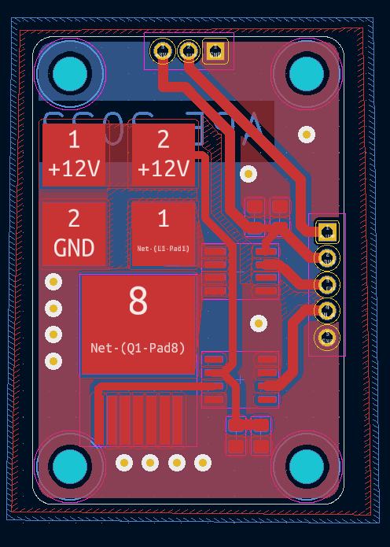
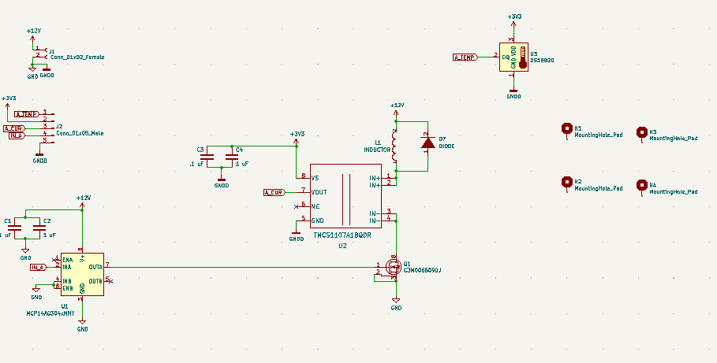
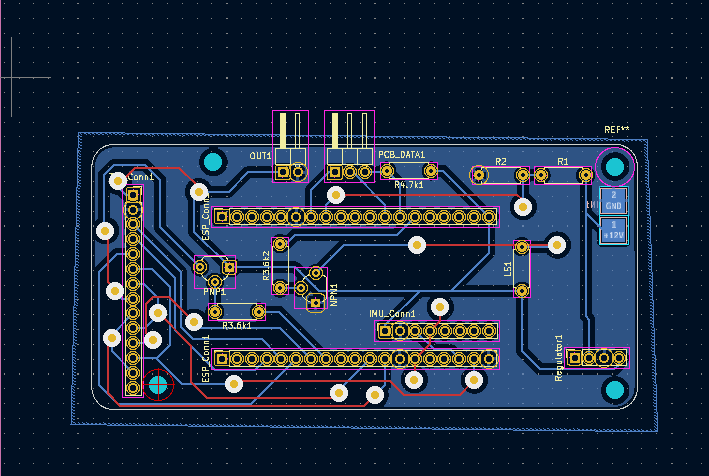
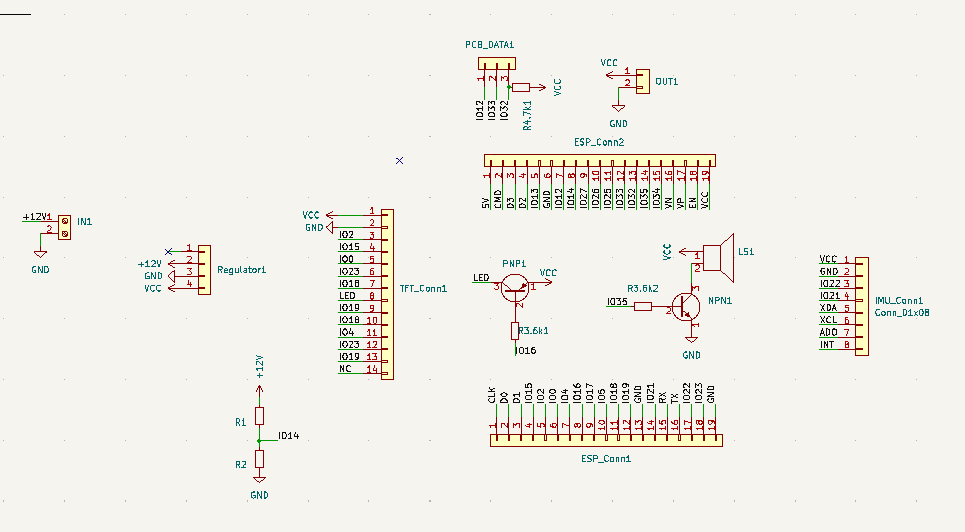
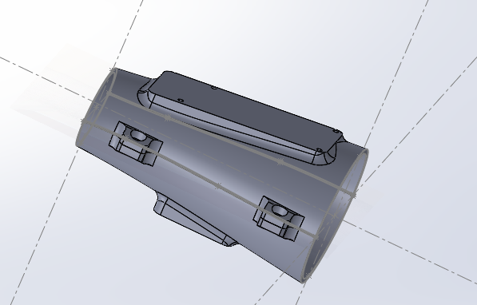
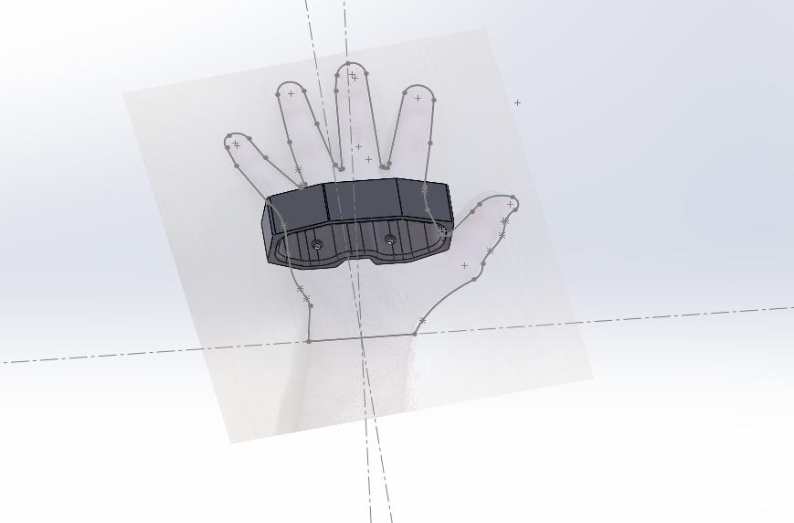
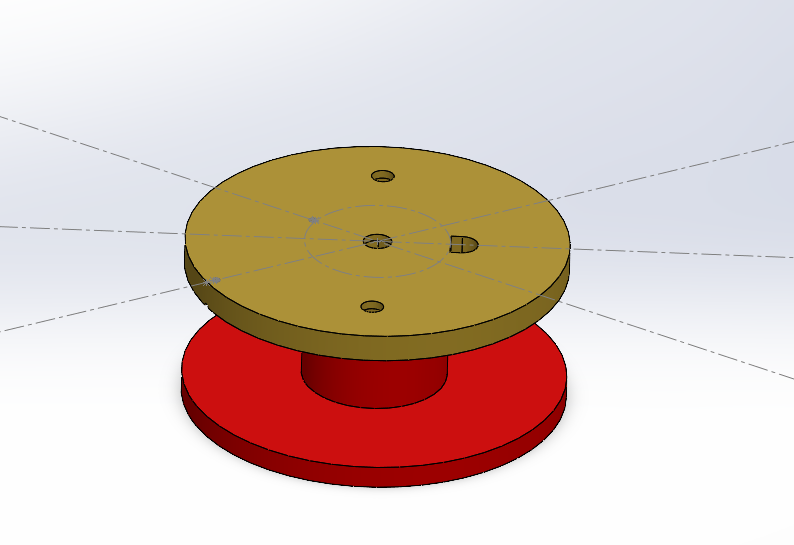
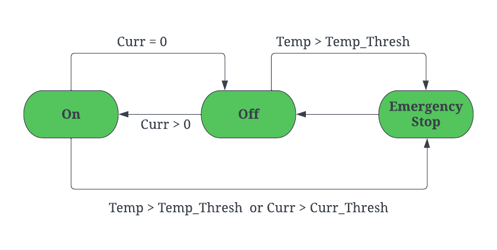

Nikolai

<iframe width="480" height="300" src="https://www.youtube.com/embed/RmYVuiprXAE" title="YouTube video player" frameborder="0" allow="accelerometer; autoplay; clipboard-write; encrypted-media; gyroscope; picture-in-picture" allowfullscreen></iframe>

# Documentation

## Overview

Nikolai is a 3D printed Gauntlet outfitted with electromagnets with high holding force. This gives a potential user the ability to hold metal objects in odd configurations, provided they are under certain weight conditions. Nikolai also has a streamlined user interface which varies power to the coils, monitors temperature fluctuations, and enables remote configuration. The system has three main parts, the electronics, the embedded microcontroller, and the server-side integration. On the electronics side we have three main sections of our design, power delivery (located on the upper arm), microcontroller with peripherals (forearm and wrist), and the one coil (palm). In terms of our embedded systems design there are two main FSMs. First we have the operations FSM which dictates the system behavior based on user input and current state variables (temperature, current, etc.).  Then there is the UI FSM, which takes user input and displays different menus or pages based on the input. The last part of our system, the server-side integration, takes all the data from the ESP32 and sends it to our server for long term storage. It displays this information on a streamlined web interface and allows for manual configuration of the gauntlet.

## Hardware

### Coil

The Coil was made by manually winding ~700 turns of 24 guage wire, using a drill. We wound the wire around a custom 3D printed cylindrical casing with a bore for the Permalloy Core. The 3D printed design also allows the coil to be mounted onto a users hand and makes room for a temprature sensor and flyback diode. Testing shows that the coil can take up 145 W for roughly 3 Seconds before heating is of concern.

<iframe width="480" height="300" src="https://youtube.com/embed/-3nESWdEpc8" title="YouTube video player" frameborder="0" allow="accelerometer; autoplay; clipboard-write; encrypted-media; gyroscope; picture-in-picture" allowfullscreen></iframe>

### Coil Driver PCB

There are three components that make up the coil driver PCB, a high power mosfet, mosfet gate driver, and a current sensor. This PCB has 3 ports. One port that takes in temprature sensor data and outputs PWM actuated power to the coil. The second port takes in power and an input signal from the ESP32 and outputs data (temperature and current) to the ESP32. The last port is for taking in the power and ground from the 3S lipo.

### Wrist PCB 

This PCB houses the ESP32, LCD touch screen and several other components. This PCB connects all the peripherals togethor and is powered directly from the battery. The LiPo Voltage is dropped down to 3V3 volts via a switching regulator, this ensures maximum efficiency. Upon first inspection the switching regulator could have to much of a voltage ripple for the ESP32, however after inspecting the output with an Osciliscope we found that the signal was safe for the microcontroller.

### 3D Printed Parts/CAD

To mount all the PCBs onto one system we designed 3D printed parts which could be attached to a users hand and wrist. We manually mapped the geometry of one our gorup memebers wrist, forearm, and hand then created mounts for each PCB and the coil. We designed each part in Solidworks 2021. Once the CAD was done we 3D printed on an Ultimaker 3S, using tough PLA. 

## State Diagrams

We have a state diagram for limiting the current and the temperature. If either the current or the temperature gets too high, we set a flag to TRUE, and don't set it back again until there is a prolonged period of low current and low temperature.

<!-- Markdeep: -->
