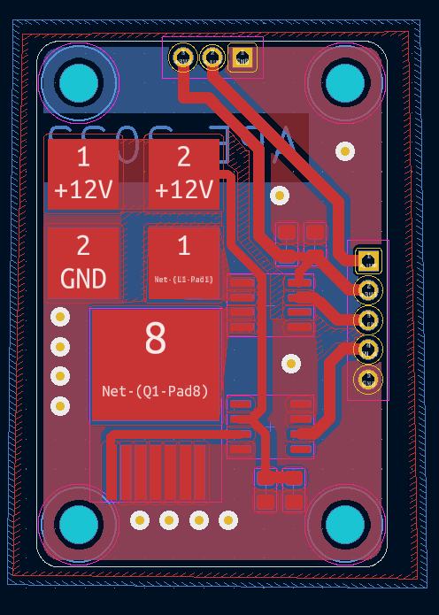
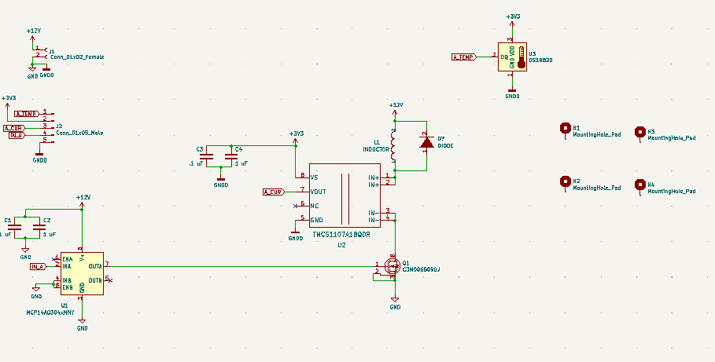
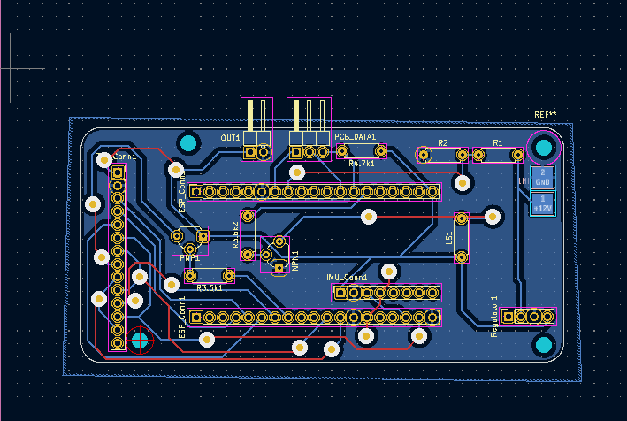
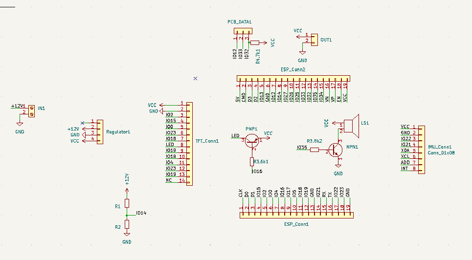
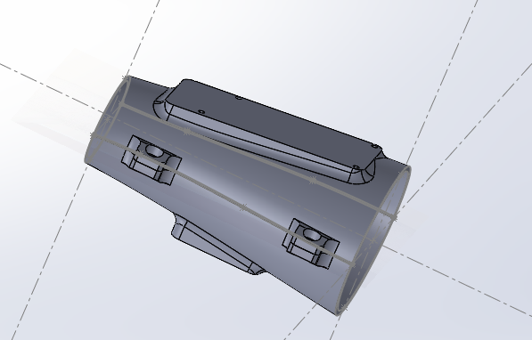
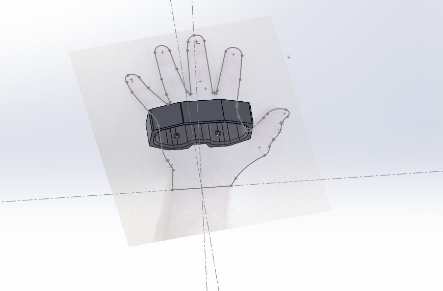
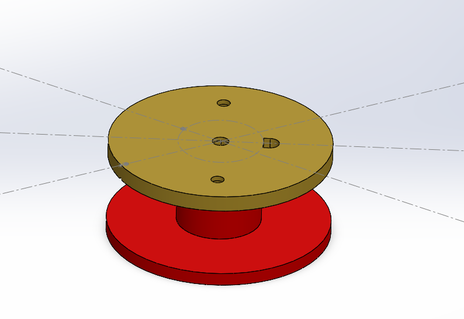
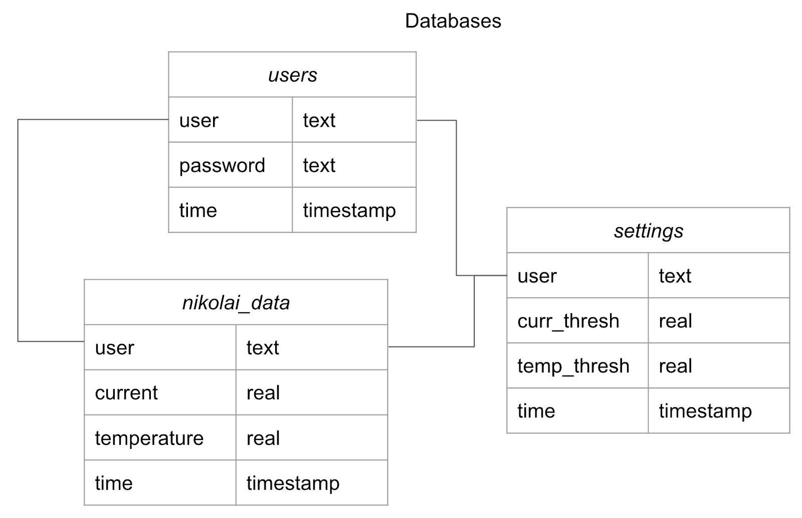
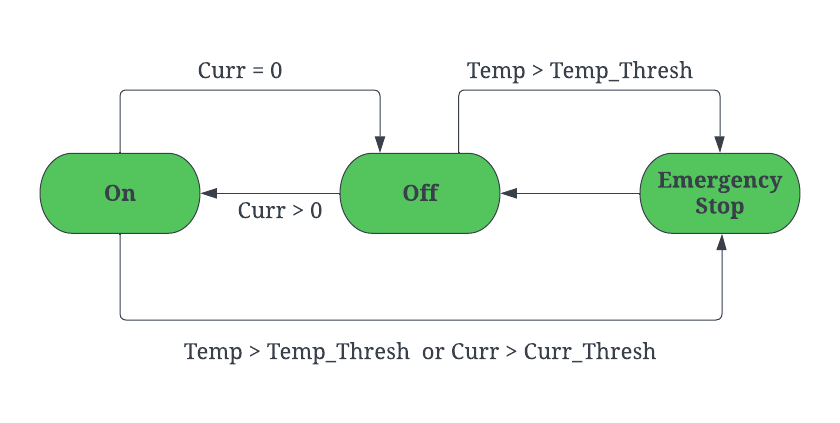

Nikolai

<iframe width="480" height="300" src="https://www.youtube.com/embed/RmYVuiprXAE" title="YouTube video player" frameborder="0" allow="accelerometer; autoplay; clipboard-write; encrypted-media; gyroscope; picture-in-picture" allowfullscreen></iframe>
# Documentation
## Overview
Nikolai is a 3D printed Gauntlet outfitted with electromagnets with high holding force. This gives a potential user the ability to hold metal objects in odd configurations, provided they are under certain weight conditions. Nikolai also has a streamlined user interface which varies power to the coils, monitors temperature fluctuations, and enables remote configuration. The system has three main parts, the electronics, the embedded microcontroller, and the server-side integration. On the electronics side we have three main sections of our design, power delivery (located on the upper arm), microcontroller with peripherals (forearm and wrist), and the one coil (palm). In terms of our embedded systems design there are two main FSMs. First we have the operations FSM which dictates the system behavior based on user input and current state variables (temperature, current, etc.).  Then there is the UI FSM, which takes user input and displays different menus or pages based on the input. The last part of our system, the server-side integration, takes all the data from the ESP32 and sends it to our server for long term storage. It displays this information on a streamlined web interface and allows for manual configuration of the gauntlet.
## Hardware
### Coil
The Coil was made by manually winding ~700 turns of 24 guage wire, using a drill. We wound the wire around a custom 3D printed cylindrical casing with a bore for the Permalloy Core. The 3D printed design also allows the coil to be mounted onto a users hand and makes room for a temprature sensor and flyback diode. Testing shows that the coil can take up 145 W for roughly 3 Seconds before heating is of concern.
<iframe width="480" height="300" src="https://youtube.com/embed/-3nESWdEpc8" title="YouTube video player" frameborder="0" allow="accelerometer; autoplay; clipboard-write; encrypted-media; gyroscope; picture-in-picture" allowfullscreen></iframe>
### Coil Driver PCB
There are three components that make up the coil driver PCB, a high power mosfet, mosfet gate driver, and a current sensor. This PCB has 3 ports. One port that takes in temprature sensor data and outputs PWM actuated power to the coil. The second port takes in power and an input signal from the ESP32 and outputs data (temperature and current) to the ESP32. The last port is for taking in the power and ground from the 3S lipo.

### Wrist PCB 
This PCB houses the ESP32, LCD touch screen and several other components. This PCB connects all the peripherals togethor and is powered directly from the battery. The LiPo Voltage is dropped down to 3V3 volts via a switching regulator, this ensures maximum efficiency. Upon first inspection the switching regulator could have to much of a voltage ripple for the ESP32, however after inspecting the output with an Osciliscope we found that the signal was safe for the microcontroller.

### 3D Printed Parts/CAD
To mount all the PCBs onto one system we designed 3D printed parts which could be attached to a users hand and wrist. We manually mapped the geometry of one our gorup memebers wrist, forearm, and hand then created mounts for each PCB and the coil. We designed each part in Solidworks 2021. Once the CAD was done we 3D printed on an Ultimaker 3S, using tough PLA. 

## Server

The server side of the project consists of two parts; the API and the HTML webpage. The API consists of a request handler that responds both to GET and POST requests sent to the server either from the ESP32 or the webpage. The HTML webpage uses the API to display statistics of the gauntlet and settings for a certain user once they log into the page.

## API

Delving into the API, the request handler is made to handle different requests from the ESP and webpage. Since these can be either GET or POST requests with different values in their bodies the request handler in the <i>server.py</i> file must be able to deal with all of them. The different requests being sent to the server are for three general purposes; to authenticate user login, to update the temperature and current monitoring, and to update user settings. All of the requests sent to the server interact with a few key databases as seen below.

The first, authenticating a user login, is done with a GET request to the server from the <i>login.html</i> webpage. In the GET request, the username and password are passed as parameters and used to check the validity of the credentials by cross-checking with the users database. If the password associated with the username in the database matches the password in the GET request, the request returns a JSON object specifying that the credentials are valid so the user can log in. Otherwise, the returned JSON object specifies that the credentials are invalid which prevents the user from logging into the home page. Since the ESP32 has users preloaded it does not need to send any GET requests for authenticating a user logging in.

The next kind of request being sent is to update the monitoring of temperature and current. Requests involving this data include both GETs and POSTs, with the former used to display the data in graphs and the latter for updating values in the database. In the GET request from the <i>home.html</i> webpage, the returned data is again a JSON object containing all the past currents and temperatures along with their associated times. This is used to construct graphs on the users home page giving a history of the gauntlet’s current draw and coil temperature. The POST requests to the server involving this data are only from the ESP32. At regular intervals, a POST request is sent to the server to update the <i>nikolai_data</i> database. Each request has a body containing the recent temperature and current values from the ESP32’s sensors as well as the current user and their password. This POST request does not return anything useful except for a tuple of the data sent as a confirmation it was added to the database.

The last types of requests being sent to the server’s request handler have to do with updating user settings and thresholds. The GET request to retrieve a user’s settings from the <i>settings</i> database must include a username and a “settings” field set to true in the parameters. This GET request is used on both the ESP32 and from the webpage to retrieve the most updated values of the user’s current and temperature thresholds. This request searches for the settings associated with the passed-in username in the <i>settings</i> database and returns a JSON object containing the threshold values. The POST requests sent to the server to update a user’s settings are similar to the POST requests to update the <i>nikolai_data</i> database. In the body of this POST are the user’s username and password as well as the new threshold setting values. When the server receives this request it authenticates the user and updates the settings associated with the username in the database. These POST requests are sent from both the ESP32 when syncing as well as from the <i>home.html</i> webpage whenever a setting is changed.

## Website

<iframe width="480" height="300" src="https://www.youtube.com/embed/UwOmpkA2iQo" title="Youtube video player" frameborder="0" allow="accelerometer; autoplay; clipboard-write; encrypted-media; gyroscope; picture-in-picture" allowfullscreen></iframe>

The webpage is divided into the login and home pages. With the login page dealing with user validation and the home page presenting both data from the Nikolai gauntlet and the user settings of the specific user logged in. 

Most of the functionality of the login page is described in the API section. Where a username and password pair is sent through a GET request to our server's request handler through the validate() method present in <i>login.html</i>. Once the JSON response is received from the server, the login script will parse the response to check for user validation, in which case the user will be sent to the homepage with both the graphs and their settings displayed. 

The Homepage will display graphs of the gauntlets temperature and current. Which are generated through a GET request to the server, which pulls temperature and current data from the esp. At the bottom of the page is the current users temperature and current thresholds, which when exceeded, turn off the gauntlet. The two thresholds can also be changed on the webpage and then a POST request is made to the server changing the user’s settings on the server database as well. Thus the esp is able to sync and change settings from the webpage through the server database.

## State Diagrams

We have a state diagram for limiting the current and the temperature. If either the current or the temperature gets too high, we set a flag to TRUE, and don't set it back again until there is a prolonged period of low current and low temperature.

## ESP32 IO

The gauntlet includes an ESP32 microprocessor to drive and monitor the signals we need. The ESP32 uses its PWM channels to power the pin outputting to the PCB coil driver (which is connected to 12V and amplifies the power). By default, the frequency is 10KHz and we use a channel resolution of 8 because we figured nobody needs more than 256 clicks of precision to power their electromagnet gauntlet (more in the ESP32 UI section).  Other analog signals include a Texas Instruments current sensor to measure the current running through the coil. The sensor maps the current linearly from a range of -2.8 to 27.7 Amps into a voltage in the range 0 to 3.3 V, which the ESP32 in turns reads as an integer in the range 0 to 4095. We then have to convert this input back to a float in the desired range with the Arduino map() function. Of course, the current sensor also has a built-in bias, which we estimated to be -1.3 A, so we add this onto the converted value. Similarly, our ESP32 measures the status of its battery, also with twelve bits of precision, and gets mapped on a range of 0 to 2.25 UNITS.
The last signal read by our ESP32 is the temperature of the coil, which is provided as a digital signal from a BRAND temperature sensor connected to pin 32. For this, we use the DallasTemperature and OneWire Arduino libraries, which allow us to communicate with the sensor directly and simply get the temperature as a float. A weird thing about temperature sensors is they seem to report negative values as positive values above the range they can actually measure. For this reason, if the signal is greater than 127, we subtract this value ??
The full pin diagram can be seen in FIGURE X
	Other than driving power to the coil, the ESP32’s main function is actually to prevent a meltdown. There exists a state machine running in the ESP32 that cuts off and disables editing power if either the current or temperature exceeds the values specified by the user. The ESP32 also sends the temperature and current data gathered by the server and POSTs them to the server under the current selected user, so historical sensor data is accessible via the Server API. 

## ESP32 UI

A person wearing the Nikolai gauntlet interacts with it via the ILI9341 touchscreen. In order to develop the UI for the touchscreen, we used the GuiSlice library which adds components that abstract the concept of pages, buttons, sliders, and icons. This significantly streamlined development of the UI, though it had a bit of a learning curve and forced us to remake elements of the UI we’d previously worked on.

The GuiSlice library allows us to define pages and the number and location of the components within them. GuiSlice also allows us to assign callback functions on different components. For example, clicking on the Power button takes us to a separate page, with its own set of icons and callbacks that can reference and edit global variables (like the frequency for the PWM module). We now discuss the flow and actions available to a user, starting with those in the Main Menu page.

The Sync button in the top-right allows the user to update their maximum temperature and maximum current thresholds by requesting the settings from the server for the currently selected user. The WiFi button is relatively straightforward and allows the user to toggle WiFi on and off to conserve battery and bandwidth.

When the user clicks on the Settings page, they will be taken to a page where they can change either the user, maximum current or maximum temperature. GuiSlice really shines here, opening up a numerical keypad the user can use to set a value when they click on the Max Current or Max Temperature fields. When the user wishes to change to a different user, they will be brought to a different page, which for now, only allows changing the user to the team members: “Ahmad”, “Sebastian”, “Daven”, “Colin”, “Howard”.  

From the Main Menu, the Power Settings page takes the user to a slider which they can use to modulate the power. Since our system also features failsafes from the sensors, the slider is set to 0 if the failsafe is triggered and the user will be unable to edit it. We have also included the current and temperature meters here, for the user’s benefit.

# Discussion

## Challenges, Decisions, and Rationale

getting the touchscreen to register anything at all was a challenge. Eventually we figured out that the TFT_eSPI package works with touchscreen as well.

very high lag in the touchscreen. switched from ad-hoc drawing things on the ili screen to GUIslice.

We decided to use a coil with more turns and thinner wire in order to increase resistance and decrease the current drawn from the battery. The rationale is that this is unequivocally a good idea if you can make it happen. No drawbacks.

# Parts List

-esp32

-ili9341

-temperature sensor

-battery

-coil

-3d-printed sleeve

# Team Members
- James Adams
- Daven Howard
- Sebastian Portalatin
- Ahmad Taka
- Colin Tang
<!-- Markdeep: -->